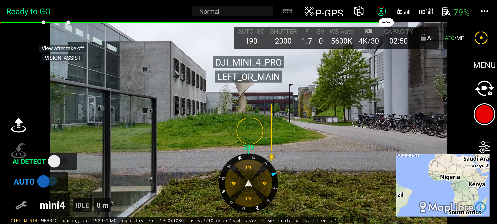
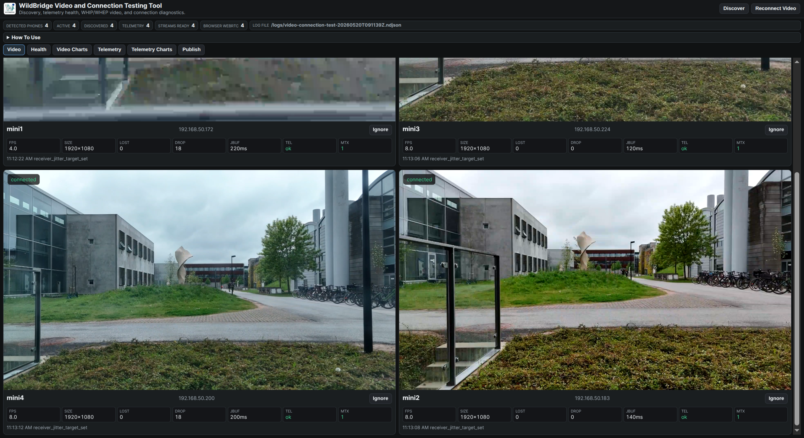
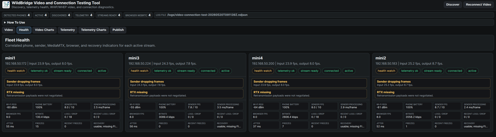
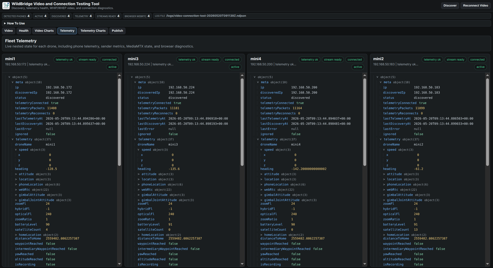
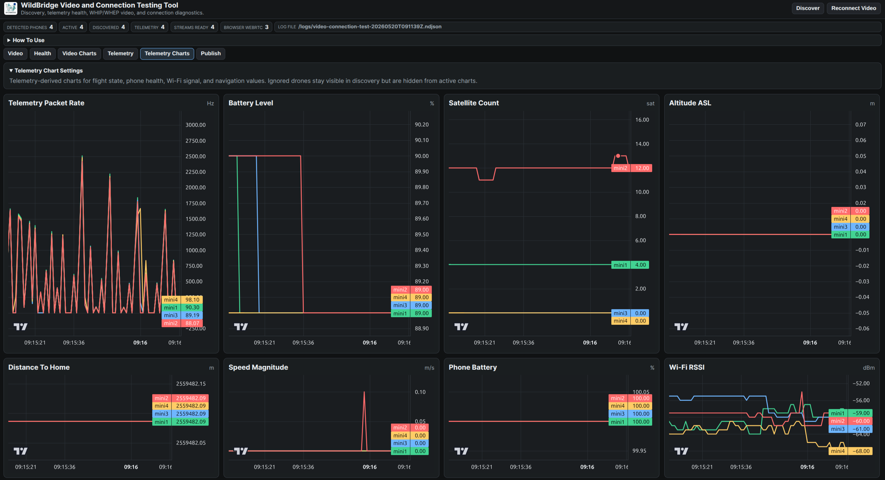
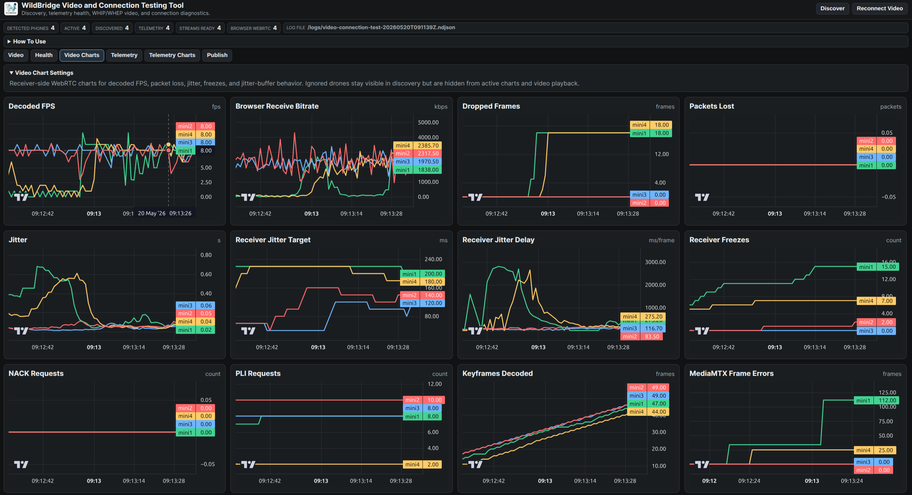

<div align="center">
  
</div>

> **WildBridge: Ground Station Interface for Lightweight Multi-Drone Control and Telemetry on DJI Platforms**  
> Part of the [WildDrone Project](https://wilddrone.eu) - European Union's Horizon Europe Research Program

## Overview

WildBridge is an open-source Android application and ground-station toolkit for DJI Mobile SDK V5 platforms. It runs on a DJI remote controller or compatible Android device, exposes telemetry and command interfaces over a local network, and can publish live drone video to browser, Python, ROS 2, and MAVLink-based workflows.

The current public repository contains the active WildBridge Android app, the UXSDK dependency module, Python and ROS 2 ground-station integrations, a MAVLink proxy for QGroundControl, a Python WebRTC viewer, and a Docker-based multi-drone video diagnostics dashboard.


## Research and Citation

This work is part of the WildDrone project, funded by the European Union's Horizon Europe Research Program (Grant Agreement No. 101071224). The WildDrone project has also received funding in part from the EPSRC-funded Autonomous Drones for Nature Conservation Missions grant (EP/X029077/1).

**Academic Papers**:
```bibtex
@inproceedings{Rolland2025WildBridge,
  author    = {Edouard Rolland and Kilian Meier and Murat Bronz and Aditya Shrikhande and Tom Richardson and Ulrik Pagh Schultz Lundquist and Anders Christensen},
  title     = {WildBridge: Ground Station Interface for Lightweight Multi-Drone Control and Telemetry on DJI Platforms},
  booktitle = {Proceedings of the 13th International Conference on Robot Intelligence Technology and Applications (RiTA 2025)},
  year      = {2025},
  month     = {December},
  publisher = {Springer},
  address   = {London, United Kingdom},
  note      = {In press},
  url       = {https://portal.findresearcher.sdu.dk/en/publications/wildbridge-ground-station-interface-for-lightweight-multi-drone-c},
}
```

## Key Features

- **Real-time telemetry**: TCP JSON stream on port 8081 with aircraft state, battery, GPS, gimbal, flight mode, and WebRTC sender metrics.
- **HTTP command API**: REST-like control endpoint on port 8080 for takeoff, landing, RTH, virtual-stick control, waypoints, camera, gimbal, manual override, and AI detection.
- **Live video streaming**: DJI camera frames can be published through WebRTC/WHIP and viewed through browser or ground-station tools; RTSP remains available through DJI/MediaMTX workflows where configured.
- **GroundStation video dashboard**: Docker Compose stack with MediaMTX and a browser grid for multi-drone WebRTC monitoring, health cards, modal diagnostics, and per-run NDJSON diagnostics.
- **Drone identity and discovery**: User-configurable drone names, `/config` endpoint, UDP broadcast discovery, UDP multicast discovery, and ROS namespace-friendly naming.
- **On-screen WildBridge HUD**: Main screen shows drone name, status, altitude, satellite count, stream state, and quick app build metadata.
- **Aircraft-safe mock video behavior**: mock/DJI video toggle stays hidden when an aircraft is connected so real flights do not accidentally switch capture source.
- **Manual override system**: RC stick input and RTH actions latch manual override and reject autonomous commands until explicitly cleared.
- **Flight logging**: JSONL flight logs and DJI TXT record syncing to persistent storage.
- **AI object detection**: DJI AutoSensing overlay and JSON access to detected targets where supported by the aircraft/platform.
- **QGroundControl and ROS 2 integration**: MAVLink proxy plus ROS 2 packages for research workflows and multi-drone experiments.

## Supported Hardware

### DJI Drones (Mobile SDK V5 Compatible)

- DJI Mini 3 / Mini 3 Pro
- DJI Mini 4 Pro
- DJI Mavic 3 Enterprise Series
- DJI Matrice 30 Series (M30/M30T)
- DJI Matrice 300 RTK
- DJI Matrice 350 RTK
- Full DJI compatibility list: <https://developer.dji.com/doc/mobile-sdk-tutorial/en/>

### Remote Controllers and Android Devices

- DJI RC Pro
- DJI RC Plus
- DJI RC-N3 with compatible Android phone
- Android phones/tablets supported by DJI Mobile SDK V5

## Quick Start

### 1. Clone the repository

```bash
git clone https://github.com/WildDrone/WildBridge.git
cd WildBridge
```

### 2. Configure the DJI API key

Create or edit `WildBridgeApp/android-sdk-v5-as/local.properties`:

```properties
AIRCRAFT_API_KEY="your-dji-app-key"
```

Optional map keys can also be supplied through `local.properties` or environment variables:

```properties
GMAP_API_KEY="your-google-maps-key"
MAPLIBRE_TOKEN="your-maplibre-token"
```

### 3. Build the Android app

The active Gradle project is `WildBridgeApp/android-sdk-v5-as`. The included modules are `:sample` and `:uxsdk`.

```bash
cd WildBridgeApp/android-sdk-v5-as
./gradlew :sample:assembleDebug
```

The debug APK is written to:

```text
WildBridgeApp/android-sdk-v5-sample/build/outputs/apk/debug/sample-debug.apk
```

### 4. Install and launch

Enable Android developer mode and USB debugging on the controller/phone, then install:

```bash
adb install -r WildBridgeApp/android-sdk-v5-sample/build/outputs/apk/debug/sample-debug.apk
```

Open WildBridge on the device. The main WildBridge screen starts the command server, telemetry server, discovery server, video components, and flight logging. The welcome screen displays build time, git state, version, feature summary, and configured drone name to help compare field devices quickly.

### 5. Connect from a ground station

Use the controller/phone IP address on the local network:

```bash
# Command API
curl http://{RC_IP}:8080/config

# Telemetry stream
nc {RC_IP} 8081
```

## Android App

The Android app extends DJI Mobile SDK V5 and UXSDK with WildBridge-specific networking, logging, video, control, and research features.

### Default Layout

The WildBridge default layout is the normal field screen. It keeps DJI's live camera view as the main surface and layers WildBridge controls and diagnostics where they can be checked quickly during flight.



The left-side WildBridge panel provides the controls most often used during research flights:

- **AI DETECT** toggles DJI AutoSensing detection and shows bounding boxes on the FPV view when supported.
- **AUTO / MANUAL** is the manual override switch. In **AUTO** mode, WildBridge accepts autonomous HTTP commands such as waypoints, trajectories, and virtual-stick navigation. Switching it to **MANUAL** activates the override latch, disables virtual stick, stops active control loops, and rejects new autonomous commands until the switch is cleared or `/send/deactivateManualOverride` is called.
- The manual override latch can also activate automatically while an autonomous control loop is running if RC stick input exceeds the configured deadzone. This lets the pilot take over without waiting for the ground station.
- **CTRL MINI4**, **CTRL M350**, or **CTRL MAVIC3** shows the detected control profile. WildBridge selects this profile from the DJI product type and uses it to choose conservative speed and PID parameters for the aircraft class.
- The lower status strip shows the configured drone name, WildBridge state, altitude, selected control profile, and current video sender diagnostics.

The WebRTC line at the bottom is a compact sender-health readout. It reports stream state, output resolution, requested resolution, source resolution, output FPS versus target FPS, dropped FPS, frame resize/processing time, scaling mode, connected client count, processing errors, and recovery count. The same metrics are included in the telemetry stream under `webRtc`, so the GroundStation dashboard can show sender FPS and processing health without relying only on browser-side receive stats.

The center and right portions remain DJI UXSDK surfaces: FPV feed, camera state, obstacle/vision indicators, map, camera controls, and aircraft status. WildBridge uses this layout so the pilot keeps the familiar DJI flight context while the ground station receives telemetry, commands, logs, discovery, and video publishing in the background.

### Main runtime services

| Service | Port | Purpose |
|---------|------|---------|
| HTTP command/config API | 8080 | Commands, status, config, AI detection, camera/gimbal control |
| TCP telemetry stream | 8081 | Continuous newline-delimited JSON telemetry |
| WebRTC / WHIP publishing | app-configured | Live video publishing and sender metrics |
| UDP broadcast discovery | 30000 | Ground-station discovery |
| UDP multicast discovery | 239.255.42.99:30001 | VLAN-friendly discovery |

### Drone identity

Tap the drone name on the WildBridge main screen to set a field-friendly name such as `mini1`, `RedScout`, or `M30T-North`. The name is used in `/config`, telemetry, logs, discovery, the GroundStation video dashboard, and ROS namespaces.

### Build metadata

The welcome screen shows:

- configured drone name
- build UTC time
- git commit hash
- git state (`clean` or `dirty`)
- Android version name/code
- feature summary

`dirty` means the APK was built with local uncommitted changes in the worktree. It is useful in the field because two devices with the same commit hash may still differ if one was built from local edits.

## GroundStation Video Dashboard

The video-test stack runs MediaMTX plus a browser dashboard for multi-drone video testing and stream diagnostics.

```bash
docker compose -f compose.video-test.yaml up -d --build
```

Default services:

| Service | Default URL / Port |
|---------|--------------------|
| Browser dashboard | http://localhost:8090 |
| MediaMTX WebRTC / WHIP / WHEP | http://localhost:8889 |
| MediaMTX API | http://localhost:9997 |
| MediaMTX RTSP | rtsp://localhost:8554 |
| ICE UDP | :8189 |

Runtime diagnostics are written under `GroundStation/video_test/logs/`. Those logs are intentionally ignored by git.

Useful restart command:

```bash
docker compose -f compose.video-test.yaml down
docker compose -f compose.video-test.yaml up -d
docker compose -f compose.video-test.yaml ps
```

### Dashboard Views

The dashboard is organized around the field views used during multi-drone tests:











## API Reference

### Telemetry Stream (TCP, Port 8081)

Connect to port 8081 to receive newline-delimited JSON telemetry. Typical fields include:

| Field | Description |
|-------|-------------|
| `droneName` | Configured WildBridge drone name |
| `speed` | Aircraft velocity |
| `heading` | Compass heading in degrees |
| `attitude` | Pitch, roll, yaw |
| `location` | GPS coordinates and altitude |
| `gimbalAttitude` | Gimbal orientation |
| `batteryLevel` | Battery percentage |
| `satelliteCount` | GPS satellite count |
| `homeLocation` | Home point coordinates |
| `distanceToHome` | Distance to home in meters |
| `flightMode` | Current DJI flight mode |
| `manualOverrideActive` | Whether manual override is latched |
| `webRtc` | Sender FPS, processing time, bitrate, and stream state when available |

### Control Endpoints (HTTP POST, Port 8080)

| Endpoint | Description | Parameters |
|----------|-------------|------------|
| `/send/takeoff` | Initiate takeoff | None |
| `/send/land` | Initiate landing | None |
| `/send/RTH` | Return to home | None |
| `/send/gotoWP` | Navigate to waypoint | `lat,lon,alt` |
| `/send/gotoWPwithPID` | Navigate with PID control | `lat,lon,alt,yaw` |
| `/send/gotoYaw` | Rotate to heading | `yaw_angle` |
| `/send/gotoAltitude` | Change altitude | `altitude` |
| `/send/navigateTrajectory` | Follow trajectory with Virtual Stick | `lat,lon,alt;...;lat,lon,alt,yaw` |
| `/send/navigateTrajectoryDJINative` | Execute DJI native waypoint mission | `lat,lon,alt;lat,lon,alt;...` |
| `/send/abort/DJIMission` | Stop DJI native mission | None |
| `/send/abortMission` | Stop and disable Virtual Stick | None |
| `/send/enableVirtualStick` | Enable Virtual Stick mode | None |
| `/send/stick` | Virtual stick input | `leftX,leftY,rightX,rightY` |
| `/send/camera/zoom` | Camera zoom control | `zoom_ratio` |
| `/send/camera/startRecording` | Start video recording | None |
| `/send/camera/stopRecording` | Stop video recording | None |
| `/send/gimbal/pitch` | Gimbal pitch control | `roll,pitch,yaw` |
| `/send/gimbal/yaw` | Gimbal yaw control | `roll,pitch,yaw` |
| `/send/setRTHAltitude` | Set return-to-home altitude | integer meters |
| `/send/abortAll` | Stop all operations | None |
| `/send/deactivateManualOverride` | Clear manual override latch | None |
| `/send/autoSensing/start` | Enable AI object detection | None |
| `/send/autoSensing/stop` | Disable AI object detection | None |

### Status and Query Endpoints (HTTP GET, Port 8080)

| Endpoint | Description |
|----------|-------------|
| `/config` | Drone name, IP, and port assignments as JSON |
| `/status/waypointReached` | Check if waypoint reached |
| `/status/intermediaryWaypointReached` | Check intermediary waypoint |
| `/status/yawReached` | Check if target yaw reached |
| `/status/altitudeReached` | Check if target altitude reached |
| `/status/camera/isRecording` | Check recording status |
| `/get/isManualOverrideActive` | Manual override state |
| `/get/autoSensing/status` | AI detection status and target count |
| `/get/autoSensing/targets` | Current detected targets with bounding boxes |

Legacy telemetry GET endpoints such as `/aircraft/allStates`, `/aircraft/location`, and `/aircraft/attitude` remain available for compatibility. New integrations should prefer the TCP telemetry stream.

## Python, MAVLink, and ROS 2

### Python ground station

```bash
pip install -r GroundStation/Python/requirements.txt
python GroundStation/Python/djiInterface.py
```

### QGroundControl via MAVLink

```bash
pip install pymavlink
cd GroundStation/Python
python mavlink_proxy.py --drone-ip {RC_IP}
```

In QGroundControl, add a UDP comm link listening on port `14550`.

The proxy maps WildBridge telemetry to MAVLink messages such as `HEARTBEAT`, `GLOBAL_POSITION_INT`, `ATTITUDE`, `SYS_STATUS`, `BATTERY_STATUS`, and `HOME_POSITION`, and maps QGC takeoff, land, RTL, and mission commands back to WildBridge HTTP endpoints.

### ROS 2

The ROS packages under `GroundStation/ROS/` provide HTTP/telemetry wrappers, RTSP video integration, MAVROS-style bridging, and launch files for single-drone and multi-drone workflows.

```bash
pip install -r GroundStation/ROS/requirements.txt
ros2 launch wildbridge_mavros auto_discovery.launch.py
```

## Project Structure

```text
WildBridge/
├── compose.video-test.yaml              # MediaMTX + browser video diagnostics stack
├── GroundStation/
│   ├── Python/                          # Python API wrappers and MAVLink proxy
│   ├── ROS/                             # ROS 2 packages and launch files
│   ├── video_test/                      # Dockerized multi-drone video dashboard
│   └── webrtc_client/                   # Python WebRTC viewer
└── WildBridgeApp/
    ├── android-sdk-v5-as/               # Active Gradle root project
    ├── android-sdk-v5-sample/           # Active WildBridge Android app source
    │   └── src/main/java/dji/sampleV5/aircraft/
    │       ├── WildBridgeDefaultLayoutActivity.kt
    │       ├── controller/              # DroneController, PID, autonomy helpers
    │       ├── formation/               # Formation-control support
    │       ├── logger/                  # Flight and DJI record logging
    │       ├── server/                  # Telemetry and network services
    │       └── webrtc/                  # WebRTC/WHIP video publishing
    └── android-sdk-v5-uxsdk/            # DJI UXSDK module used by the app
```

## Performance Notes

Based on controlled experiments with consumer-grade hardware:

- Telemetry scales to multi-drone operation with sub-second latency on normal local networks.
- Video performance depends heavily on shared Wi-Fi quality, controller hardware, and the number of simultaneous publishers.
- Six concurrent video streams is a practical upper bound before degradation in typical field Wi-Fi conditions.
- The dashboard health view distinguishes current stream degradation from historical packet/frame counters.

## Flight Logging

WildBridge logs flight data in JSONL format.

Storage locations are checked in order:

1. Removable microSD card: `WildBridge/FlightLogs/YYYY-MM-DD/HH-mm-ss_<drone>.jsonl`
2. Documents folder: `Documents/WildBridge/FlightLogs/YYYY-MM-DD/`
3. App-external fallback: `Android/data/<pkg>/files/FlightLogs/YYYY-MM-DD/`

DJI SDK TXT flight records are copied to `WildBridge/DJI_FlightRecords/` on app launch and after landing so they survive app reinstalls.

## Troubleshooting

### Connectivity

```bash
ping {RC_IP}
curl http://{RC_IP}:8080/config
nc {RC_IP} 8081
```

### Android build

```bash
cd WildBridgeApp/android-sdk-v5-as
./gradlew :sample:compileDebugKotlin
./gradlew :sample:assembleDebug
```

### Video dashboard

```bash
docker compose -f compose.video-test.yaml logs --tail=80
curl http://localhost:9997/v3/paths/list
```

### Manual override

```bash
curl http://{RC_IP}:8080/get/isManualOverrideActive
curl -X POST http://{RC_IP}:8080/send/deactivateManualOverride
```

## Limitations and Considerations

- DJI Mobile SDK V5 compatibility and aircraft capabilities determine which camera, sensing, and mission features are available.
- Multi-drone video depends on local Wi-Fi quality; prefer clean 5 GHz channels and avoid saturated access points.
- Autonomous commands should always be tested with manual override and RTH procedures available to the pilot.
- Some advanced pages from the DJI sample app remain available for inspection and development, but the WildBridge main screen is the normal field entry point.

## License

This project is licensed under the MIT License - see [LICENSE](LICENSE) for details.

## Contributing

Contributions are welcome. Please open GitHub issues with reproduction steps for bugs, and describe the research or field use case for feature requests.

For questions or collaboration inquiries, contact the WildDrone consortium at <https://wilddrone.eu>.
