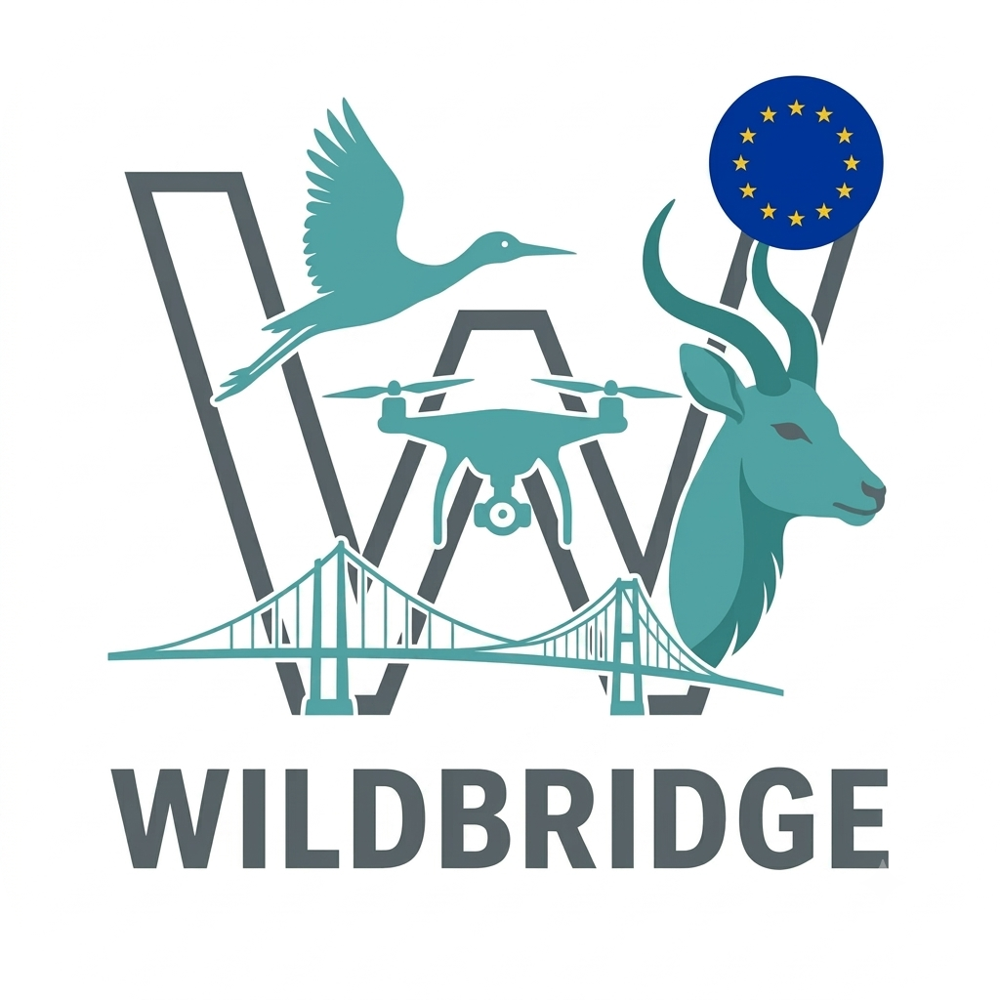
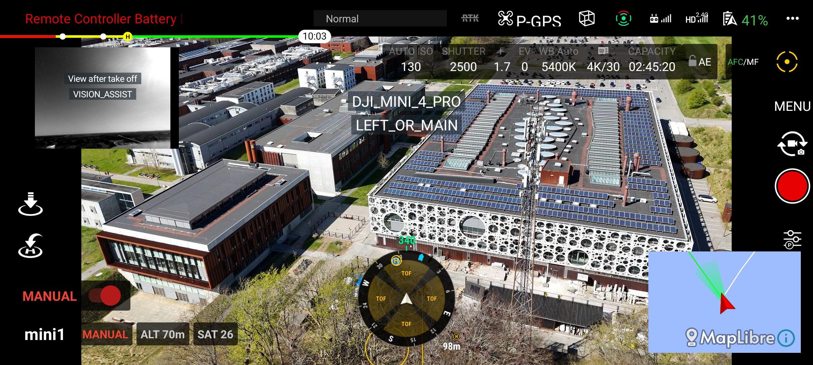

<div align="center">
  
</div>

<div align="center">

# WildBridge

**Ground Station Interface for Lightweight Multi-Drone Control and Telemetry on DJI Platforms**

[](LICENSE)
[](https://developer.dji.com/doc/mobile-sdk-tutorial/en/)
[](https://docs.ros.org/en/humble/)
[](https://wilddrone.eu)

*Part of the [WildDrone Project](https://wilddrone.eu) — European Union Horizon Europe Research Programme*

</div>

---

## Overview

WildBridge is an **open-source Android application** (Kotlin, DJI Mobile SDK V5) that runs directly on the DJI Remote Controller and exposes drone telemetry, control, and video streaming over a local Wi-Fi network. It removes the need to interact with DJI's proprietary SDK from the ground station — any language or framework with HTTP and TCP socket support can integrate with WildBridge.

Each drone connects to its RC via DJI OcuSync (2.4/5 GHz). The RC connects to the ground station over a 2.4/5 GHz LAN. Multiple WildBridge instances can coexist on the same LAN, enabling multi-drone configurations without any app modification.


*Multi-drone setup: each RC runs WildBridge and exposes unique HTTP, TCP telemetry, and WebRTC endpoints. The ground station communicates with all drones via standard HTTP commands (port 8080), TCP telemetry (port 8081), and WebRTC video (port 8082).*

---

## Key Features

- **Real-time Telemetry**: TCP socket streaming (port 8081) — continuous JSON at up to 20 Hz with 25+ flight state fields
- **HTTP Command Interface**: RESTful API (port 8080) for full drone control
- **Live Video Streaming**: WebRTC (port 8082, 720p@5fps)
- **Three Navigation Modes**: Direct Virtual Stick (AVS), on-device PID position controller, DJI native KMZ waypoint missions
- **Manual Override**: Pilot takeover detection (~30% stick deflection), with GS-readable override state and deactivation command
- **Camera Control**: Zoom ratio display and control, gimbal pitch/yaw, start/stop recording
- **Multi-drone Coordination**: Up to 10 concurrent drones over a single LAN
- **Auto-Discovery**: UDP broadcast discovery (port 30000), mDNS/Bonjour, subnet scanning
- **ROS 2 Integration**: Complete ROS 2 Humble package with 25+ topics and MAVROS-compatible bridge
- **Docker Deployment**: Pre-built container (ROS 2 Humble + CycloneDDS)

---

## Supported Hardware

**SDK Version**: DJI Mobile SDK V5 5.17.0

### DJI Drones
- DJI Mini 3 / Mini 3 Pro
- DJI Mini 4 Pro
- DJI Mavic 3 Enterprise Series (M3E)
- DJI Matrice 30 Series (M30/M30T)
- DJI Matrice 300 RTK
- DJI Matrice 350 RTK
- DJI Matrice 4 Thermal (M4T)
- Full list: [DJI Mobile SDK Tutorial](https://developer.dji.com/doc/mobile-sdk-tutorial/en/)

### Remote Controllers
- **DJI RC Pro** — Primary supported controller
- **DJI RC Plus** — Enterprise compatibility
- **DJI RC-N3** — Standard controller (tested with smartphones)

---

## User Interface

WildBridge runs on the RC's built-in Android display. All servers (HTTP port 8080, TCP telemetry port 8081, WebRTC port 8082) start automatically when the app launches from the main default layout — no additional navigation required.



The **Manual Override** checkbox is checked automatically when the pilot moves RC sticks beyond ~30% deflection while airborne. When active, all HTTP navigation commands are rejected. The GS reads `isManualOverrideActive` from the TCP telemetry stream and can call `/send/deactivateManualOverride` to restore autonomous control.

---

## Published Use Cases & Demo Videos

WildBridge has been used in the following research applications (Rolland et al., RiTA 2025):

| Study | UAVs | Features | Description | Video |
|-------|------|----------|-------------|-------|
| Drone Swarm for Wildlife Monitoring | 2× Mini 3, 1× M3E | T, V, WP | ROS 2 multi-drone monitoring of zebra herds; semi-autonomous waypoint missions; 15 m vertical separation | [▶ Watch](https://www.youtube.com/watch?v=PzHnbgxLaSU) |
| Drone Swarm for Wildfire Detection | 1× M3E, 1× M4T, 2× M300 | T, V, WP | Autonomous thermal + visual wildfire detection; coordinated take-off, search, detection, verification, payload drop; XPRIZE Wildfire semi-finalist | [▶ Watch](https://www.youtube.com/watch?v=F73VcUoOzo8) |
| Atmospheric Wind Field Profiling | 3× Mini 3 | T | Vertical wind profiles from attitude data validated against LiDAR (ENAC Lab) | [▶ Watch](https://www.youtube.com/watch?v=KZ40L-y1xt8) |
| Custom PID Position Controller | — | C | On-device PID controller demo | [▶ Watch](https://www.youtube.com/watch?v=j52ovMPVt_I) |

*T = Telemetry · V = Video · WP = Waypoint control · C = Low-level control*

---

## Quick Start

### Prerequisites

1. DJI drone + compatible RC, 5 GHz Wi-Fi access point, ground station computer
2. [Android Studio Koala 2024.1.2](https://redirector.gvt1.com/edgedl/android/studio/ide-zips/2024.1.2.13/android-studio-2024.1.2.13-linux.tar.gz)
3. DJI developer account + API key from [developer.dji.com](https://developer.dji.com/)

### Install the App

```bash
git clone https://github.com/WildDrone/WildBridge.git
```

1. Open `WildBridge/WildBridgeApp/android-sdk-v5-as` in Android Studio.
2. Add your API key to `local.properties`:
   ```
   AIRCRAFT_API_KEY="Your_App_Key"
   ```
3. Build and deploy to your RC (enable Developer Mode + USB Debugging first).

### Start the Server

1. Launch the WildBridge app on the RC — servers start automatically on the home screen.
2. Note the Device IP shown in the app (or use auto-discovery).
3. Press **Enable Virtual Stick** (via `/send/enableVirtualStick` or the app UI) before sending navigation commands.

### Ground Station Dependencies

```bash
pip install -r GroundStation/Python/requirements.txt   # Python interface
pip install -r GroundStation/ROS/requirements.txt      # ROS 2 interface
```

### Connect and Control

**Telemetry (TCP, port 8081):**
```python
import socket, json

sock = socket.socket(socket.AF_INET, socket.SOCK_STREAM)
sock.connect(("192.168.1.100", 8081))
buffer = ""
while True:
    buffer += sock.recv(4096).decode('utf-8')
    while '\n' in buffer:
        line, buffer = buffer.split('\n', 1)
        if line.strip():
            t = json.loads(line)
            print(f"Battery: {t['batteryLevel']}%  Alt: {t['location']['altitude']:.1f}m  Sats: {t['satelliteCount']}")
```

**Commands (HTTP POST, port 8080):**
```python
import requests

rc = "192.168.1.100"
requests.post(f"http://{rc}:8080/send/takeoff")
requests.post(f"http://{rc}:8080/send/gotoWPwithPID", data="49.306254,4.593728,20,90,5.0")
requests.post(f"http://{rc}:8080/send/navigateTrajectoryDJINative",
              data="10.0;49.306,4.593,20;49.307,4.594,25;49.308,4.595,20")
requests.post(f"http://{rc}:8080/send/RTH")
```

**Video (WebRTC, port 8082):**
```bash
python GroundStation/webrtc_client/webrtc_drone_viewer.py --server ws://192.168.1.100:8082
python webrtc_drone_viewer.py --server ws://192.168.1.100:8082 --save-video out.mp4
python webrtc_drone_viewer.py --server ws://192.168.1.100:8082 --headless --save-frames ./frames/
```

---

## Python Interface (`DJIInterface`)

`GroundStation/Python/djiInterface.py` provides a high-level class wrapping all HTTP commands and the TCP telemetry socket in a thread-safe background receiver.

```python
from djiInterface import DJIInterface

# Auto-discovery via UDP broadcast (port 30000) if no IP provided
dji = DJIInterface("192.168.1.100")

# Start background telemetry thread (TCP socket, port 8081)
dji.startTelemetryStream()

# Read latest telemetry (thread-safe, returns copy of last JSON snapshot)
print(dji.getBatteryLevel())          # int: 0–100
print(dji.getLocation())              # {'latitude': ..., 'longitude': ..., 'altitude': ...}
print(dji.getHeading())               # float: compass degrees
print(dji.getAttitude())              # {'pitch': ..., 'roll': ..., 'yaw': ...}
print(dji.getGimbalAttitude())        # {'pitch': ..., 'roll': ..., 'yaw': ...}
print(dji.getSatelliteCount())        # int
print(dji.getFlightMode())            # str: 'GPS', 'ATTI', 'VIRTUAL_STICK', 'GO_HOME', ...
print(dji.isManualOverrideActive())   # bool
print(dji.getRemainingFlightTime())   # int: seconds
print(dji.getDistanceToHome())        # float: metres
print(dji.getZoomRatio())             # float

# Commands
dji.requestSendTakeOff()
dji.requestSendLand()
dji.requestSendRTH()                  # Aborts mission first, then RTH
dji.requestSendEnableVirtualStick()
dji.requestAbortMission()             # Abort + disable Virtual Stick
dji.requestAbortDJINativeMission()    # Abort DJI native mission only

# Navigation
dji.requestSendGoToWPwithPID(49.306254, 4.593728, 20.0, yaw=90, speed=5.0)
dji.requestSendNavigateTrajectory(
    [(49.306, 4.593, 20), (49.307, 4.594, 25)], finalYaw=90)
dji.requestSendNavigateTrajectoryDJINative(
    [(49.306, 4.593, 20), (49.307, 4.594, 25), (49.308, 4.595, 20)], speed=10.0)
dji.requestSendGotoYaw(45.0)
dji.requestSendGotoAltitude(30.0)

# Camera / gimbal
dji.requestSendGimbalPitch(-30.0)
dji.requestSendGimbalYaw(45.0)
dji.requestSendZoomRatio(4.0)
dji.requestCameraStartRecording()
dji.requestCameraStopRecording()

# Manual override
dji.requestDeactivateManualOverride()

# RTH altitude
dji.requestSetRTHAltitude(50.0)

# PID tuning
dji.requestSendGoToWPwithPIDtuning(
    lat, lon, alt, yaw,
    kp_pos=1.0, ki_pos=0.0, kd_pos=0.2,
    kp_yaw=1.0, ki_yaw=0.0, kd_yaw=0.1)

# Virtual stick (raw AVS, values saturated to ±0.3 by DJIInterface)
dji.requestSendStick(leftX=0, leftY=0.2, rightX=0.1, rightY=0)

dji.stopTelemetryStream()
```

---

## API Reference

### Telemetry (TCP Socket — Port 8081)

Continuous newline-delimited JSON stream. Connect and read; the app pushes updates automatically.

**Telemetry fields:**

| Field | Type | Description |
|-------|------|-------------|
| `droneName` | `string` | Drone name (set via app UI) |
| `speed` | `{x, y, z}` | Velocity (m/s) |
| `heading` | `float` | Compass heading (degrees) |
| `attitude` | `{pitch, roll, yaw}` | Aircraft attitude (degrees) |
| `location` | `{latitude, longitude, altitude}` | GPS position |
| `phoneLocation` | `{latitude, longitude, heading, pressure, battery, wifiRssi}` | Operator phone/RC location and sensor data |
| `gimbalAttitude` | `{pitch, roll, yaw}` | Gimbal orientation (degrees) |
| `gimbalJointAttitude` | `{pitch, roll, yaw}` | Gimbal joint angles (degrees) |
| `zoomRatio` | `float` | Camera zoom ratio |
| `zoomFl` / `hybridFl` / `opticalFl` | `float` | Focal lengths (-1 if unavailable) |
| `batteryLevel` | `int` | Battery % (0–100) |
| `satelliteCount` | `int` | GPS satellite count |
| `homeLocation` | `{latitude, longitude}` | Home point coordinates |
| `homeSet` | `bool` | Home point set |
| `distanceToHome` | `float` | Distance to home (m) |
| `waypointReached` | `bool` | Final waypoint reached |
| `intermediaryWaypointReached` | `bool` | Intermediate waypoint reached |
| `yawReached` | `bool` | Target yaw reached |
| `altitudeReached` | `bool` | Target altitude reached |
| `isRecording` | `bool` | Camera recording active |
| `flightMode` | `string` | GPS / ATTI / VIRTUAL_STICK / GO_HOME / AUTO_LANDING / WAYPOINT / MANUAL |
| `remainingFlightTime` | `int` | Remaining flight time (s) |
| `timeNeededToGoHome` | `float` | Time to return home (s) |
| `timeNeededToLand` | `float` | Time to land (s) |
| `totalTime` | `float` | Go-home + land time (s) |
| `maxRadiusCanFlyAndGoHome` | `float` | Max safe flyable radius (m) |
| `batteryNeededToGoHome` | `float` | Battery % needed for RTH |
| `batteryNeededToLand` | `float` | Battery % needed to land |
| `remainingCharge` | `int` | Raw remaining battery charge from SDK |
| `seriousLowBatteryThreshold` | `float` | Critical low battery % |
| `lowBatteryThreshold` | `float` | Low battery warning % |
| `isManualOverrideActive` | `bool` | Pilot has taken manual RC control |

---

### Control Endpoints (HTTP POST — Port 8080)

| Endpoint | Body | Description |
|----------|------|-------------|
| `/send/takeoff` | — | Takeoff |
| `/send/land` | — | Land |
| `/send/RTH` | — | Return to home (aborts active mission + disables VS first) |
| `/send/enableVirtualStick` | — | Enable Virtual Stick mode |
| `/send/abortMission` | — | Stop mission + disable Virtual Stick |
| `/send/abortAll` | — | Stop all active missions (DJI native + Virtual Stick) |
| `/send/abort/DJIMission` | — | Stop DJI native mission only |
| `/send/stick` | `leftX,leftY,rightX,rightY` | Direct AVS velocity input (values ∈ [-1, 1]) |
| `/send/gotoWP` | `lat,lon,alt` | Navigate to waypoint (basic) |
| `/send/gotoWPwithPID` | `lat,lon,alt,yaw[,speed]` | PID position controller (default speed: 5.0 m/s) |
| `/send/gotoWPwithPIDtuning` | `lat,lon,alt,yaw,kp_pos,ki_pos,kd_pos,kp_yaw,ki_yaw,kd_yaw` | PID with custom gains |
| `/send/navigateTrajectory` | `lat,lon,alt;…;lat,lon,alt,yaw` | Trajectory via Virtual Stick PID; last WP includes yaw |
| `/send/navigateTrajectoryDJINative` | `speed;lat,lon,alt;…` | DJI native KMZ mission (≥ 2 waypoints) |
| `/send/gotoYaw` | `yaw_degrees` | Rotate to heading |
| `/send/gotoAltitude` | `altitude_m` | Change altitude |
| `/send/gimbal/pitch` | `roll,pitch,yaw` | Set gimbal pitch |
| `/send/gimbal/yaw` | `roll,pitch,yaw` | Set gimbal yaw joint angle |
| `/send/camera/zoom` | `zoom_ratio` | Set camera zoom |
| `/send/camera/startRecording` | — | Start recording |
| `/send/camera/stopRecording` | — | Stop recording |
| `/send/setRTHAltitude` | `altitude_m` | Set RTH altitude |
| `/send/deactivateManualOverride` | — | Re-enable autonomous commands after pilot override |

### Status Endpoints (HTTP GET — Port 8080)

| Endpoint | Returns | Description |
|----------|---------|-------------|
| `/config` | JSON | Drone name, IP, HTTP/telemetry/WebRTC ports |

> All other flight state data is available via the TCP telemetry stream on port 8081. Use `GET /config` for connection metadata and auto-discovery.

---

### Video Streaming

#### WebRTC (Port 8082)

The app acts as the WebRTC **offerer**. Viewers connect via WebSocket, register as `"viewer"`, and receive an SDP offer. A negotiated data channel (label `"telemetry"`, `id=0`, ordered) delivers per-frame JSON metadata alongside the video track:

```json
{
  "frameNumber": 1042,
  "latitude": 49.306254, "longitude": 4.593728,
  "altitudeASL": 120.5, "altitudeAGL": 20.3,
  "gimbalPitch": -30.0, "gimbalYaw": 0.0, "gimbalRoll": 0.0,
  "aircraftPitch": 2.1, "aircraftYaw": 87.3, "aircraftRoll": -1.5,
  "velocityX": 3.2, "velocityY": 0.1, "velocityZ": -0.5,
  "batteryPercent": 78, "satelliteCount": 15
}
```

Resolution options: SD / HD / **Full HD (720p, default)** · Frame rate: **5 fps**

Camera source options: Left / Right / Top / **FPV (Vision Assist, default)**

---

## Drone Identity & Auto-Discovery

- **Custom naming**: Set drone name via the app UI (tap the name display). Examples: `"RedScout"`, `"Bravo"`.
- **UDP broadcast discovery**: `DJIInterface("")` broadcasts `DISCOVER_WILDBRIDGE` on port 30000; the app replies `WILDBRIDGE_HERE:{ip}`.
- **Config endpoint**: `/config` returns drone name and connection metadata (used by ROS auto-discovery).
- **Dynamic ROS namespaces**: Nodes launch under the drone's name (e.g., `/RedScout/location`), eliminating manual IP-to-name mapping.

---

## ROS 2 Integration

Full ROS 2 Humble package. The `dji_controller` node publishes all telemetry fields as individual topics at **20 Hz** and subscribes to command topics.

### Package Structure

```
GroundStation/ROS/
├── dji_controller/          # Main control + telemetry node
│   ├── controller.py        # DjiNode: 25+ topics, 20 Hz timer
│   └── submodules/dji_interface.py
├── wildbridge_mavros/       # MAVROS-compatible bridge
│   ├── mavros_bridge.py     # WildBridgeMavrosNode
│   ├── auto_mavros_bridge.py# Auto-discovery + dynamic namespace launch
│   └── dji_interface.py
└── wildview_bringup/
    ├── swarm_connection.launch.py      # Multi-drone: MAC→IP resolution via ARP
    ├── auto_discovery.launch.py
    ├── auto_discovery_native.launch.py
    └── config/parameters.yaml
```

### Published Topics (per drone namespace `/drone_N/`)

| Topic | Type | Description |
|-------|------|-------------|
| `speed` | `Float64` | Velocity magnitude (m/s) |
| `speed_vector` | `Vector3` | Velocity vector x, y, z (m/s) |
| `heading` | `Float64` | Compass heading (degrees) |
| `attitude` | `String` | `{pitch, roll, yaw}` JSON |
| `location` | `NavSatFix` | GPS latitude, longitude, altitude |
| `gimbal_attitude` | `String` | `{pitch, roll, yaw}` JSON |
| `gimbal_joint_attitude` | `String` | Joint angles JSON |
| `gimbal_yaw` / `gimbal_pitch` | `Float64` | Individual gimbal angles |
| `zoom_fl` / `hybrid_fl` / `optical_fl` | `Float64` | Focal lengths (-1 if N/A) |
| `zoom_ratio` | `Float64` | Camera zoom ratio |
| `battery_level` | `Float64` | Battery % |
| `satellite_count` | `Int32` | GPS satellite count |
| `waypoint_reached` | `Bool` | Final WP flag |
| `intermediary_waypoint_reached` | `Bool` | Intermediate WP flag |
| `altitude_reached` / `yaw_reached` | `Bool` | Reach flags |
| `home_location` | `NavSatFix` | Home GPS coordinates |
| `home_set` | `Bool` | Home point set flag |
| `distance_to_home` | `Float64` | Distance to home (m) |
| `remaining_flight_time` | `Float64` | Remaining flight time (s) |
| `time_needed_to_go_home` | `Float64` | Time to RTH (s) |
| `time_needed_to_land` | `Float64` | Time to land (s) |
| `time_to_landing_spot` | `Float64` | Go-home + land (s) |
| `max_radius_can_fly_and_go_home` | `Float64` | Max safe radius (m) |
| `battery_needed_to_go_home` | `Float64` | Battery % for RTH |
| `battery_needed_to_land` | `Float64` | Battery % to land |
| `camera/is_recording` | `Bool` | Recording status |
| `flight_mode` | `String` | Current DJI flight mode string |
| `manual_override_active` | `Bool` | Pilot override active |

### Subscribed Topics (commands)

| Topic | Type | Body |
|-------|------|------|
| `command/takeoff` | `Empty` | — |
| `command/land` | `Empty` | — |
| `command/rth` | `Empty` | — |
| `command/abort_mission` | `Empty` | — |
| `command/abort_all` | `Empty` | — |
| `command/enable_virtual_stick` | `Empty` | — |
| `command/abort_dji_native_mission` | `Empty` | — |
| `command/deactivate_manual_override` | `Empty` | — |
| `command/camera/start_recording` | `Empty` | — |
| `command/camera/stop_recording` | `Empty` | — |
| `command/goto_waypoint` | `Float64MultiArray` | `[lat, lon, alt, yaw, speed?]` |
| `command/goto_waypoint_pid_tuning` | `Float64MultiArray` | `[lat,lon,alt,yaw,kp_pos,ki_pos,kd_pos,kp_yaw,ki_yaw,kd_yaw]` |
| `command/goto_trajectory` | `String` | `"[(lat,lon,alt),...], finalYaw"` |
| `command/goto_trajectory_dji_native` | `String` | `"(speed, [(lat,lon,alt),...])"` |
| `command/goto_yaw` | `Float64` | Yaw angle (degrees) |
| `command/goto_altitude` | `Float64` | Altitude (m) |
| `command/gimbal_pitch` | `Float64` | Pitch (degrees) |
| `command/gimbal_yaw` | `Float64` | Yaw joint angle |
| `command/zoom_ratio` | `Float64` | Zoom ratio |
| `command/set_rth_altitude` | `Float64` | RTH altitude (m) |
| `command/stick` | `Float64MultiArray` | `[leftX, leftY, rightX, rightY]` ∈ [-1,1] |

### MAVROS-Compatible Bridge (`wildbridge_mavros`)

For applications built for PX4/ArduPilot. `WildBridgeMavrosNode` publishes standard MAVROS topics:

| Topic | Type |
|-------|------|
| `mavros/global_position/global` | `NavSatFix` |
| `mavros/local_position/pose` | `PoseStamped` (metres from home) |
| `mavros/local_position/velocity_local` | `TwistStamped` |
| `mavros/imu/data` | `Imu` |
| `mavros/battery` | `BatteryState` |
| `mavros/global_position/compass_hdg` | `Float64` |
| `mavros/global_position/rel_alt` | `Float64` |
| `mavros/global_position/satellites` | `UInt32` |
| `mavros/state/connected` / `armed` / `mode` | `Bool` / `Bool` / `String` |
| `wildbridge/waypoint_reached` | `Bool` |
| `wildbridge/distance_to_home` | `Float64` |
| `wildbridge/flight_time_remaining` | `Float64` |

**Setpoint subscribers**: `mavros/setpoint_position/local` (PoseStamped → GPS WP), `mavros/setpoint_position/global` (NavSatFix → direct), `mavros/setpoint_velocity/cmd_vel` (TwistStamped → AVS, max 10 m/s), `mavros/setpoint_attitude/attitude` (PoseStamped → gimbal pitch).

**Services**: `mavros/cmd/arming`, `mavros/cmd/takeoff`, `mavros/cmd/land`, `mavros/cmd/rtl`, `mavros/set_mode/offboard`, `wildbridge/enable_virtual_stick`, `wildbridge/abort_mission`.

### Usage

**Docker (single-drone, auto-discovery):**
```bash
cd GroundStation
docker build -t wildbridge-ros .
docker run --rm --network=host wildbridge-ros
```

The image is based on `ros:humble` with CycloneDDS, `cv-bridge`, `vision-opencv`, `image-transport`, plus all Python dependencies.

**Manual multi-drone launch:**
```bash
cd GroundStation/ROS
colcon build --symlink-install && source install/setup.bash

# Edit swarm_connection.launch.py for your drone IPs/MACs, then:
ros2 launch wildview_bringup swarm_connection.launch.py

# Example commands
ros2 topic pub /drone_1/command/takeoff std_msgs/msg/Empty "{}"
ros2 topic pub /drone_1/command/goto_waypoint std_msgs/msg/Float64MultiArray \
  "data: [49.306254, 4.593728, 20.0, 90.0, 5.0]"
```

The `swarm_connection.launch.py` resolves each drone's IP from its MAC address via `ip neigh show` (ARP table), then launches one `dji_node` per drone.

**MAVROS auto-discovery:**
```bash
ros2 run wildbridge_mavros auto_mavros_bridge
# Discovers all drones, queries /config for drone name, launches with /{name} namespace
```

---

## Project Structure

```
WildBridge/
├── WildBridgeApp/
│   ├── android-sdk-v5-as/               # Main Android project (open this in Android Studio)
│   │   ├── VirtualStickFragment.kt      # Fragment: battery listener, video init stubs
│   │   └── local.properties             # Place AIRCRAFT_API_KEY here
│   ├── android-sdk-v5-sample/           # Full sample app with WildBridge additions
│   │   └── src/main/
│   │       ├── java/dji/sampleV5/aircraft/webrtc/  # WebRTC server (Kotlin)
│   │       ├── res/layout/
│   │       │   ├── frag_virtual_stick_page.xml      # Virtual Stick UI
│   │       │   └── frag_webrtc_stream.xml           # WebRTC UI
│   │       └── assets/webrtc_viewer.html            # Browser WebRTC viewer
│   └── android-sdk-v5-uxsdk/           # DJI UXSDK UI components
└── GroundStation/
    ├── Python/
    │   └── djiInterface.py             # DJIInterface class (HTTP + TCP telemetry)
    ├── webrtc_client/
    │   └── webrtc_drone_viewer.py      # Python WebRTC viewer (aiortc + OpenCV)
    ├── Dockerfile                      # ros:humble + CycloneDDS container
    ├── entrypoint.sh                   # Container entry point
    ├── run_docker.sh                   # Docker run helper
    └── ROS/
        ├── dji_controller/             # ROS 2 control + telemetry node
        ├── wildbridge_mavros/          # MAVROS-compatible bridge + auto-discovery
        └── wildview_bringup/           # Launch files and config
```

---

## Limitations

| Limitation | Detail |
|------------|--------|
| Video–telemetry sync | Streams are not synchronised; a sync manoeuvre at mission start is needed for post-mission alignment |
| Manual override | Once latched, autonomous commands are fully blocked until `/send/deactivateManualOverride` is called |
| SDK dependency | Relies on DJI Mobile SDK V5; SDK updates may require app changes |
| Setup time | Multi-drone configurations require registering IPs and completing pre-flight checks on the GS |

---

## Troubleshooting

**Connection refused:**
- Verify the WildBridge app is running on the RC (servers start on launch).
- Check the RC is on the same LAN as the GS.

**Drone does not respond to navigation commands:**
- Press **Enable Virtual Stick** in the app or call `/send/enableVirtualStick`.
- Check `isManualOverrideActive` in telemetry; call `/send/deactivateManualOverride` if needed.

**WebRTC not connecting:**
- Check the WebRTC screen shows "RUNNING" status.
- Try the Python viewer: `python webrtc_drone_viewer.py --server ws://{RC_IP}:8082 --debug`

---

## Research and Citation

This work is part of the **WildDrone** project, funded by the European Union's Horizon Europe Research Programme under the Marie Skłodowska-Curie Grant Agreement No. 101071224, with additional funding from the EPSRC grant *Autonomous Drones for Nature Conservation Missions* (EP/X029077/1) and the Independent Research Fund Denmark (10.46540/4264-00105B).

```bibtex
@inproceedings{Rolland2025WildBridge,
  author    = {Edouard G.A. Rolland and Kilian Meier and Murat Bronz and
               Aditya M. Shrikhande and Tom Richardson and
               Ulrik P.S. Lundquist and Anders L. Christensen},
  title     = {{WildBridge}: Ground Station Interface for Lightweight
               Multi-Drone Control and Telemetry on {DJI} Platforms},
  booktitle = {Proceedings of the 13th International Conference on
               Robot Intelligence Technology and Applications (RiTA 2025)},
  year      = {2025},
  month     = {December},
  publisher = {Springer},
  address   = {London, United Kingdom},
  note      = {In press},
  url       = {https://portal.findresearcher.sdu.dk/en/publications/wildbridge-ground-station-interface-for-lightweight-multi-drone-c},
}
```

---

## License

MIT License — see [LICENSE](LICENSE) for details.

## Contributing

Bug reports and feature requests: [GitHub Issues](https://github.com/WildDrone/WildBridge/issues).  
For collaboration enquiries, contact the WildDrone consortium at [wilddrone.eu](https://wilddrone.eu).
